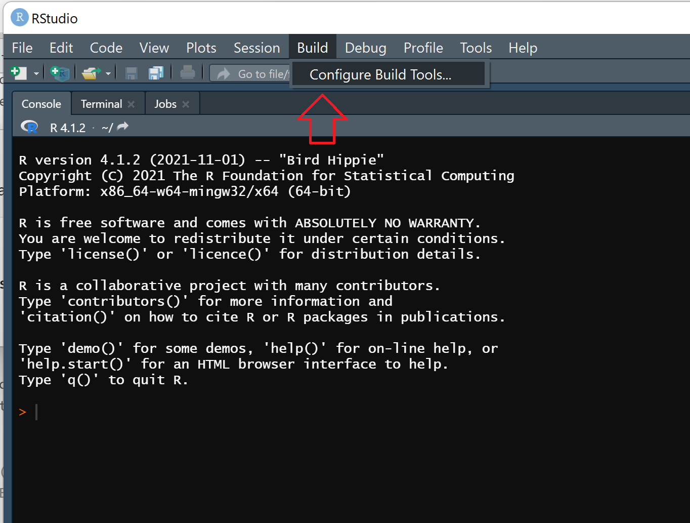

# Module Build Process {#ve-buildprocess}


## Introduction
This chapter describes the package build process for creating or modifying packages and their constituent modules within the VisionEval framework. The build process can be used to incorporate localized or custom data into VE by making a change to a module and then rebuilding the package that is it part of. This chapter includes two case studies that discuss examples of localizing estimation data and walk through the process of substituting data in a module and re-building the VisionEval package that it is part of.

The steps involved in the process include:

- Collect the input data for the package
- Preprocess the input data into the required format
- Update the data files in the VisionEval package source
- Build and install the package for use in VisionEval
- Use the re-built package in your model


## Context
The VisionEval "build process" rebuilds VisionEval packages to incorporate modified data in the module's model estimation and data processing steps in order to update data resources such as PUMS (Public Use Microdata Samples from the US Census) and estimated model coefficients. The build process can be conducted through R or RStudio starting with the VisionEval code available from its Github repository.

The reason that a modified module must be rebuilt before it is available for use in VisionEval is that the VisionEval framework relies on importing each module from an R package. The data resources in any R package cannot be updated directly. Instead the R package that contain the modified module must be rebuilt from its source. R packages are a fundamental unit of the R ecosystem and create a structured way to bundle code, data, and documentation together into a single unit for distribution. Packages can be easily installed and shared among R users. VisionEval itself is distributed as a set of R packages, and those packages are what must be rebuilt to incorporate any localized data or other user made modifications.

There are two ways to set up VisionEval to rebuild a package with localized data.

  1. The most general approach is to start with the source
code located in the [VisionEval GitHub repository](https://github.com/VisionEval/VisionEval) and to use the build system included with that code. Using that integrated build process will ensure that all the parts of VisionEval are consistent. This steps for rebuilding packages are documented in the ["build/Building.md"](https://github.com/VisionEval/VisionEval/blob/master/build/Building.md) file in the Github source tree.
  + Install [Git for Windows](https://git-scm.com/) or equivalent\
(optional: makes it easier to access the repositories)
  + [Install R](https://www.r-project.org/)\
(usually the most recent version works; must be 3.6.0 or later, currently recommend 4.1.3)
  + [Install RTools 4.0](https://cran.r-project.org/bin/windows/Rtools/rtools40.html)
  + [Install RStudio](https://www.rstudio.com/)\
(a version compatible with RTools40, and with the version of R you're using)
  + Copy or clone the [VisionEval](https://github.com/VisionEval/VisionEval) (or [VisionEval-Dev](https://github.com/VisionEval/VisionEval-dev)) repository
  + Start RStudio and open the VisionEval-dev.Rproj project file\ (On most graphic display machines, just double-click it)
  + Execute the `ve.build()` function:\
  (A full build from scratch takes from 45 minutes to an hour and a
  half on a typical Windows machine. A build on other architectures may
  take longer as many of the dependency packages will have to be built
  from source code.)

```
ve.build()
```
  + Once the build is done, you can get into the runtime environment in several ways:
    1. By executing ve.run() from the VisionEval-dev RStudio project.
    2. By entering your file manager program, navigating to the runtime directory and
double-clicking the VisionEval.Rproj RStudio project file down in the
runtime directory (as you would for the standard binary release installer).
    3. Starting the R GUI (or R terminal) for the version of R that you used to build
VisionEval, setting the working directory (`setwd`) to the runtime folder you
just built, and then `source`-ing `Visioneval.R`
  + If the build is successful, you can make an installer .zip file by doing this:
```
ve.build("installer")
```

  2. Alternatively, you can start with a binary VisionEval installation (unzipping the installer file) and then unzip the VisionEval source code file ("src") to create a "src" directory within your runtime. The steps for rebuilding a package using this method are document in ["build/RStudio.md"](https://github.com/VisionEval/VisionEval/blob/master/build/RStudio.md) in the Github source tree.
  + Download the runtime installer (zip file) from [the VisionEval Download Page](https://visioneval.org/category/download.html "VisionEval Download")
    * Pick the installer for your version of R and your Operating System
    * Windows and Mac OSX are supported for binary installations
  + Install the PackageSources (zip file) for the same release date, also from [the VisionEval Download Page](https://visioneval.org/category/download.html "VisionEval Download")
    * Just unzip the PackageSources into the exact same folder you put the VisionEval runtime
    * It will create a new `src` sub-directory next to the other VisionEval folders
  + On a Windows machine, make sure you have [RTools40](https://cran.r-project.org/bin/windows/Rtools/rtools40.html)
    * RStudio itself will help you get it, or you can download and install it manually.

### Generic VisionEval Module

Using the GitHub approach with ve.build, the package source is located in `VisionEval\sources\modules\VEGenericPackage` and there will be no "data" folder, just the other elements. The key in both cases is to locate the `inst\extdata` folder and replace the key files in that location.

An exception to this is the VETravelDemandMM package, which has an offline step to construct data files (due to its dependency on non-public data).

VisionEval packages will generally have a structure similar to the following:

```
src/VEGenericPackage
├───data
│   ├─ GenericPackageSpecifications.rda
│   ├─ GenericPackage_df.rda
│   └─ GenericPackage_ls.rda
├───R
│   ├─ CreateEstimationDatasets.R
│   └─ GenericModel.R
└───inst
    └─ extdata
        ├─ input_data1.csv
        └─ input_data2.txt
```

- The root 'src' directory location depends on which build method was used. If built from the github source, it will reside in a built folder (e.g., `GitCloneVisionEval\built\visioneval\4.x.x\src\VEGenericPackage`), and if unzipped from the installer it will reside where it was unzipped (e.g., `MyUnzippedVisionEval\src\VEGenericPackage`)

- `inst\extdata` is where localized input data and reference files will be placed
-  The `R` directory contains any R scripts used in the packages
- `data` contains the datastore files generated/estimated by the R scripts
- `man` and `inst\module_docs`, contain the markdown documentation generated during the build process.

Some VisionEval packages include helper scripts to facilitate formatting the input data required to build the packages, with names like `CreateEstimationDatasets.R. Those should be run manually prior to rebuilding the package to ensure that the files in inst/extdata are correctly formatted.

### Generic Package Building

There are several different ways to build an R package:
1. RStudio GUI
2. command line
3. devtools package


### Build using Rstudio GUI

RStudio comes with a GUI for building packages. There are many tutorials and [RStudio build documentations](https://support.rstudio.com/hc/en-us/articles/200486488?version=2021.09.1%2B372&mode=desktop) available on the internet.

1. Check current R runtime library path. It is critical to ensure that your VisionEval R project runtime environment is loaded and the current working directory is `VESimHouseholds`. It can be checked by entering `.libPaths()` in the console. If the VisionEval library is loaded, it will be listed as item 1, for example:
```
[1] "C:/git_clone_directory/VisionEval-Dev/built/visioneval/4.1.2/ve-lib"
[2] "C:/Program Files/R/R-4.1.2/library"
```

2. Check the current working directory, which should the package directory, using `getwd()` and can be set using:
```
setwd("C:/git_clone_directory/VisionEval-Dev/built/visioneval/4.1.2/src/VESimHouseholds")
```

3. Select Configure Build Tools from the Build menu:
{width=75%}

4. Set the package directory to the VE module (e.g., src/VEGenericPackage) and the build source
{width=75%}

5. Build and install the package.
{width=75%}


### Build using command line
The fundamental command to build an r package can be run from R console using `system("R CMD INSTALL package_path -l lib_path")`. The GUI method essentially constructs this command and executes it.

- `package_path` is the path to the package you are building. If your working directory is already located in the package, you can use `.` to denote the local directory.
- `lib_path`

```
system("R CMD INSTALL . -l C:\your_git_clone_folder\VisionEval-Dev\built\visioneval\4.1.2\ve-lib")

```

### Build using devtools
Alternatively, the [devtools](https://www.r-project.org/nosvn/pandoc/devtools.html) provides a useful suite of tools for package building.

```
# This runs the scripts and creates documentation, if included
devtools::document()

# This builds the VESimHouseholds data and scripts into an R package
devtools::build()

# This then installs the VESimHouseholds package into VisionEval library
devtools::install()
```

## Case Study 1 - PUMS data in VESimHouseholds

### Using Local PUMS data in VESimHouseholds
The VESimHouseholds package contains a number of modules that work within the VisionEval framework to simulate households and their characteristics. The critical purpose of this package is that the data contained within the package are available throughout the VisionEval framework simply by referencing the [VESimHouseholds](https://github.com/VisionEval/VisionEval/tree/master/sources/modules/VESimHouseholds) package. The source code for this package is located on the VisionEval github repository [sources/modules/VESimHouseholds](https://github.com/VisionEval/VisionEval/tree/master/sources/modules/VESimHouseholds).

It is recommended that package modifications be made within your local VisionEval build (i.e., after running `ve.build()`) located in `VisionEval\built\visioneval\4.x.x\src\`, and not the cloned source modules. That way any changes can be reverted to the default VisionEval version by re-running `ve.build()`. The ".x.x" will be replaced by whichever R version was used during the build.

### Objective of the Case Study
The objective of this case study is to substitute the default Oregon-based Public Use Microdata Sample (PUMS) data with PUMS data from another state . This is done in three major steps:

1. Preprocess and format "raw" PUMS data into the comma separated value (.CSV) files for VisionEval input
2. Create the estimated dataset stored as R data files (.Rda) for VisionEval (commonly referred to as "datastore" format, see the [lexicon documentation](https://rsginc.github.io/VisionEval-Docs/conceptprimer.html#lexicon) for more detailed terminologies). This element is part of building the package to generate the data for installation and may require building twice to ensure the changes take effect.
3. Re-build and install the VisionEval package to make the updated module available with local data.


### Input files being modified
As mentioned, the default data inputs provided with VESimHouseholds are PUMS data for Oregon from the 2000 Decennial US Census. The input files are two .CSV files, with the following names and file paths:

- `VESimHouseholds/inst/extdata/pums_households.csv`
- `VESimHouseholds/inst/extdata/pums_persons.csv`

The two .CSV files contain disaggregated person and household data linked by a primary key id field. The files have the following fields and field values.

```
HOUSEHOLDS
----------
SERIALNO: Housing/Group Quarters Unit Serial Number
PUMA5: 5% Public Use Microdata Area code
HWEIGHT: Housing unit weight
UNITTYPE: Type of housing unit
    0 = Housing unit
    1 = Institutional group quarters
    2 = Noninstitutional group quarters
PERSONS: Number of persons living in housing unit
BLDGSZ: Size of Building
    blank = group quarters
    1 = mobile home
    2 = detached one-family house
    3 = attached one-family house
    4 = building with 2 apartments
    5 = building with 3 or 4 apartments
    6 = building with 5 to 9 apartments
    7 = building with 10 to 19 apartments
    8 = building with 20 to 49 apartments
    9 = building with 50 or more apartments
    10 = boat, RV, van, etc.
HINC: Household Total Income in 1999
```

```
PERSONS
-------
SERIALNO: Housing/Group Quarters Unit Serial Number
AGE: Age
WRKLYR: Worked in 1999
    0 = Not in universe (Under 16 years)
    1 = Yes
    2 = No
INCTOT: Person's Total Income in 1999
    NA = Not in universe (Under 15 years)
    ?019998 = Loss of $19,998 or more
    ?000001..019997 = Loss of $1 to $19,997
    0000000 = No/none
    0000001 = $1 or break even
    0000002..4999999 = $2 to $4,999,999
    5000000 = $5,000,000 or more
```

The data are disaggregated records of individual persons and households. For example, household data might look like this:

| SERIALNO| PUMA5| HWEIGHT| UNITTYPE| PERSONS| BLDGSZ|   HINC|
|--------:|-----:|-------:|--------:|-------:|------:|------:|
|       45| 25080|      22|        0|       1|      9|  68100|
|       92| 25060|      17|        0|       3|      5| 105530|
|      103| 25090|      21|        0|       2|      6| 359000|
|      142| 25100|      25|        0|       2|      2| 141500|
|      157| 25100|       0|        1|       1|     NA|      0|
|      159| 25070|      22|        0|       1|      2|  14700|

And an example of the persons data might look like this:

| SERIALNO| AGE| WRKLYR| MILITARY| INCTOT|
|--------:|---:|------:|--------:|------:|
|       45|  66|      1|        4|  68100|
|       92|  28|      1|        4|  33000|
|       92|  28|      1|        4|  37000|
|       92|  26|      1|        4|  35530|
|      103|  53|      1|        4|  33000|
|      103|  53|      1|        4| 326000|
|      142|  49|      1|        4| 111500|
|      142|  49|      1|        4|  30000|
|      157|  39|      1|        4|   2100|
|      159|  80|      2|        2|  14700|


Note that the two data files are also linked by a primary key field `SERIALNO`. For each unique household, there are one or more persons linked to that household by the `SERIALNO` key.


### Step 1 - Preprocessing

To start, we must download our new "raw" PUMS data and format it to match the current VisionEval input files. Processing and formatting can be done manually using spreadsheets and text editors, but some PUMS data are stored in a space saving format that most spreadsheets and humans cannot easily read.

To help with this process, an R script was written with functions that both download the PUMS data and preprocess the data into .CSV files for VisionEval, located here: https://github.com/RSGInc/VEProcessPUMS

**NOTE:** It is important to note here that VisionEval household and person fields are based on the 2000 <em>Decennial Census</em> PUMS.

For year 2000 and earlier, PUMS data were based on the Decennial Census counted every ten years. <u>Post-2000 PUMS</u> are based on the American Community Survey (ACS), which is a sampling-based survey method collected continuously rather than from a full Decennial Census. Statistically, the ACS-based PUMS are reliable, but the fields <u>differ</u> and will need to be migrated to match the inputs used by VisionEval. More [PUMA history](https://www2.census.gov/geo/pdfs/reference/puma/puma_history.pdf) can be read online at the US Census website.

- [2000 Decennial Census PUMS](https://www2.census.gov/census_2000/datasets/PUMS/)
- [Post-2000 ACS PUMS](https://www2.census.gov/programs-surveys/acs/data/pums/)

### 2000 PUMS (aka Census PUMS)
2000 PUMS data comes in two forms, 1% and 5%, which the Census explains as:

> "The 1-percent super-PUMAs were used to present 1-percent PUMS files, were required to contain a minimum population of 400,000 persons, and had to nest within states. These super-PUMAs were a new geographic entity for Census 2000 and were aggregations of the smaller, 5-percent PUMAs.
>
> The 5-percent PUMAs were used to present the 5-percent PUMS files, were required to contain a minimum population of 100,000 persons, and had to nest within states. PUMAs could consist of a single county or an aggregation of one or more counties, census tracts, or minor civil divisions (MCDs) in the New England states. Additionally, an incorporated place with a minimum population of 100,000 persons could be defined as a PUMA."

Basically the 1% PUMS have more persons, but cover a larger geographic area than the 5% PUMS. In this case we are looking to download the revised 5% data. Within each state directory (e.g., https://www2.census.gov/census_2000/datasets/PUMS/FivePercent/California/) there will be several files.

```
PUMEQ5-CA.TXT	        30-Aug-2003 05:21	1.0M
PUMS5_06.TXT	        30-Aug-2003 05:35	677M
REVISEDPUMS5_06.TXT   26-Oct-2010 14:24	676M
all_California.zip    02-Sep-2003 23:08	98M
```

The file named `REVISEDPUMS5_06.TXT` is the file to download. However, the data for both households and persons are stored in a continuous string, which is not an easy to parse delimited format (e.g., comma separated). Extracting the data and converting it into a tabular data frame is non-trivial.

To help with this process, an R function called `process_2000_pums()` was written in the [VEProcessPUMS](https://github.com/RSGInc/VEProcessPUMS/blob/master/R/ProcessPUMS.R) package to read the `.txt` files, extract the data columns need, convert to R data frames, and then export the remaining data into the two person and household `.csv` files as VESimHousehold input.

### Post-2000 PUMS (aka ACS PUMS)
Post-2000 PUMS data are typically stored as separate .CSV files for persons and households. This makes parsing and importing the data into R very easy. However, the columns are different and the new column names will need to be identified and migrated over. Below is a column crosswalk to translate ACS PUMS to the required field names.

#### Household {-}

|2000 PUMS Field | ACS PUMS Field Name|
| -------------- | ------------------ |
| SERIALNO       | SERIALNO           |
| PUMA5          | PUMA               |
| HWEIGHT        | WGTP               |
| UNITTYPE       | TYPE               |
| PERSONS        | NP                 |
| BLDGSZ         | BLD                |
| HINC           | HINCP              |

#### Persons {-}

|2000 PUMS Field | ACS PUMS Field Name|
| -------------- | ------------------ |
| SERIALNO       | SERIALNO           |
| AGE            | AGEP               |
| WRKLYR         | WKL                |
| MILITARY       | MIL                |
| INCTOT         | PINCP              |


### Preprocessing for VisionEval input data
You can either manually download the text file and process the PUMS data, or use the automated R wrappers `getACSPUMS()` and `getDecPUMS()`.

#### Manually download PUMS and process using process_2000_pums() & process_acs_pums() {-}
An example PUMS processing using the `process_2000_pums` and `process_acs_pums`:
```
# For the 2000 data:
# process_2000_pums() function reads in REVISEDPUMS5_06.TXT,
# parses the data into two dataframes for persons and households, then
# returns a list('p'= person_df, 'h' = household_df)
# It has two input parameters:
#  - PumsFile: path to PUMS TXT data
#  - GetPumas: optional vector of PUMAS ids, defaults to 'ALL'

PUMS_DATA_LIST <- process_2000_pums(PumsFile='REVISEDPUMS5_06.TXT', GetPumas='ALL')
```

The process is similar using the process_acs_pums(). You can specify the path for the extracted .csv or the .zip file. It has one additional parameter to specify the file type as either 'p' for persons or 'h' for households. For example:

```
# For the ACS data:
PUMS_DATA_LIST <- process_acs_pums(PumsFile='csv_pca.csv', type='p' GetPumas='ALL')
```

Then you only need to save the data frames to a csv:

```
# Using base R write.csv
write.csv(PUMS_DATA_LIST[['p']],
          file = file.path(output_dir, 'pums_persons.csv'),
          row.names = FALSE)

# Using fwrite() from `data.table`
fwrite(PUMS_DATA_LIST[['p']],
       file = file.path(output_dir, 'pums_persons.csv'))
```

#### Automatically download PUMS and process using getDecPUMS and getACSPUMS{-}

To streamline the whole process, there is also a download wrapper function which both downloads and calls the pre-processing function. The user only needs to specify the State (and year if using ACS) that they want PUMS data from. For example:

```
# This function downloads the PUMS txt data to a temporary file,
# parses it using the process_2000_pums function, then
# saves or returns the processed data.
# It has two input parameters:
# - STATE: This can be the State name, abbreviation, or fips code
#          (e.g., California, CA, or 6)
# - output_dir: Optional path to save the files pums_persons.csv and pums_households.csv
#               NA path returns the dataframes in a list

# Get 2000 Decennial Census PUMS
# data_list <- getDecPUMS(STATE='CA', output_dir = NA)
getDecPUMS(STATE='CA', output_dir = './output_folder')
```

Similarly, ACS PUMS data for more recent years can be downloaded. For example:

```
# Get ACS PUMS for specified year
# data_list <- getACSPUMS(STATE='CA', YEAR='2020', output_dir = NA)
getACSPUMS(STATE='CA', YEAR='2020', output_dir = './output_folder')
```


### Step 2 - Create the VisionEval estimation data sets

The next step is to use the R scripts in VESimHouseholds to re-generate the VisionEval `.Rda` data files stored in `VESimHouseholds\data`. These data files are stored in a structure and format (e.g., data frames) that VisionEval can use as part of the framework.

1. Start by instantiating the VisionEval R project environment by loading your model build's `VisionEval.Rproj`. If you have already built your VisionEval using `ve.build()`, you will have a `VisionEval.Rproj` file in your `built` directory. For example, `VisionEval\built\visioneval\4.1.2\runtime\VisionEval.Rproj`.

2. Next navigate to the VESimHousehold package and set your current working directory to the `your_path_to_this/VESimHouseholds` folder. (hint <em>Session -> Set Working Directory</em>)

3. Run the R data generation scripts. Depending on the purpose of the module you are working with, the generation R script may vary. For example, the `VESimHouseholds/R/CreateEstimationDatasets.R` script reads in the .csv input data we created and creates the household data `Hh_df.rda` for VisionEval in the data folder. If another datastore is being modified, the respective generation script will need to be run.

   Within the package's "R" folder, some will save a datastore with the command `visioneval::savePackageDataset()`, some may not need any data updates, and others might only contain model functions with no immediate output saved.

### Step 3 - Build the VESimHouseholds package
Although the previous step generated the R data files, your current VisionEval environment will still be using the old data from the built version of the package. You will need to re-build and re-install the VESimHousehold package for VisionEval to replace the package with a new version containing the new input data. Any of the three build processes described above can be used.

Once the package re-build is complete, your new PUMS data will be ready to use in a VisionEval model run.

## Case Study 2 - Powertrain data in VEPowertrainsandFuels

### VEPowertrainsandFuels - Changing Inputs for a Scenario Test
This second case study explores a common challenge when certain inputs are embedded in a package and users want to modify the model values within the package (often this is in order to create an alternative scenario). The critical purpose of the VEPowertrainsandFuels package is to process vehicle and fuel characteristics files that model users may optionally supply. Users can develop custom scenarios by modifying the relevant input files included in the 'inst/extdata' directory of the source package and build the package.

### Objective of VEPowertrainsandFuels Case Study
The objective of this case study is to define a custom function which alters the default data values as they are read into VisionEval during the build process.

### Data

`VEPowertrainsAndFuels\inst\extdata\hh_powertrain_prop.csv` are the default powertrain proportions contained in the package, which resembles the table below (the table is compressed to select years for clarity). The file's purpose is to provide the proportion of vehicle powertrain types by vehicle type (auto and light trucks) and vehicle vintage year.

|ModelYear|AutoPropIcev|AutoPropHev|AutoPropPhev|AutoPropBev|LtTrkPropIcev|LtTrkPropHev|LtTrkPropPhev|LtTrkPropBev|
|---------|------------|-----------|------------|-----------|-------------|------------|-------------|------------|
|1975     |1           |0          |0           |0          |1            |0           |0            |0           |
|2000     |1           |0          |0           |0          |1            |0           |0            |0           |
|2010     |0.8786      |0.1213     |0           |0.0001     |0.9820       |0.0180      |0            |0           |
|2020     |0.8212      |0.0788     |0.0202      |0.0798     |0.9524       |0.0143      |0.0067       |0.0266      |
|2030     |0.6676      |0.0908     |0.0358      |0.2058     |0.9093       |0.0179      |0.0106       |0.0622      |
|2040     |0.5701      |0.0922     |0.0403      |0.2974     |0.8996       |0.0191      |0.0114       |0.0698      |
|2050     |0.5198      |0.0895     |0.0407      |0.3500     |0.8916       |0.0193      |0.0119       |0.0772      |

The table contains two powertrain proportions, the left-most four columns are for automobiles (i.e., `AutoProp`) and the right-most are for light trucks (i.e., `LtTrkProp`). Each will sum up to 1 (for a rowsum of 2).

### Input modification

This section walks users through modifying the data as they are read in to VisionEval. Before modifying the code, a brief analysis is conducted to define a modifying function and demonstrate the effects if the modifications. The next subsection utilizes the function in the `LoadDefaultValues.R` script to modify `hh_powertrain_prop.csv` as the data are read in.

**Note:** The same results of this case study can be achieved by simply modifying the hh_powertrain_prop.csv input file, similar to as done in Case Study 1, but in this demonstration purposes we will modify the generation script rather than the input data.

### Analysis

To begin, the code snippets below conduct a brief exploratory analysis to demonstrate visually what the data look like and how they will be modified. Using some helper packages `ggplot2` and `reshape` we can format the data for visualization. **Note:** These packages are not necessary for modifying the data in VisionEval, but are used for formatting and plotting in this case study.


```
# Additional packages
library(ggplot2)
library(reshape)

# Load data, uncomment it to run in your project
hh_powertrain_prop <- read.csv('.YOUR_PACKAGE_DIRECTORY/inst/extdata/hh_powertrain_prop.csv')

melted_powertrains <- reshape::melt(hh_powertrain_prop, id.vars = 'ModelYear')

ggplot(data = melted_powertrains) +
  geom_line(aes(x=ModelYear, y=value, color=variable)) +
  scale_y_continuous(labels=scales::percent) +
  theme_classic()
```

{width=75%}


We can see that battery electric vehicles (BEV), specifically automobiles, are projected to make up the majority of vehicles bought in future years. This causes the share of internal combustion engine to decline proportionally.

Let us assume that the state government is deciding whether to aggressively promote BEV cars starting in 2025. The policies cause the share of alternative powertrains (BEV, HEV, and PHEV) to increase more over time. To model this increase, we will use an arbitrary function which adds to the current value of $x$ (i.e., the proportion) at a quadratic rate.

$$
f(x) = x + x^2 (1 - x)
$$
We then create a wrapper function that adjusts each of the alternative powertrains using our custom modeling function. To ensure that the proportions sum up to 1 for autos and light trucks, respectively, we then calculate the remaining proportion of ICE powertrains by subtracting the proportion of alternative powertrains.

```
# Wrapper function to adjust the powertrain data
adjust_powertrain <- function(powertrain_df, start_year) {
  # Define our adjustment functions
  adj_fun <- function(xv) xv + (xv^2) * (1 - xv)

  # Which columns to modify
  cols <- colnames(powertrain_df)
  ev_cols <- cols[grepl('Hev|Phev|Bev', cols)]
  ice_cols <- cols[grepl('Icev', cols)]

  # Create the modified data frame
  df_mod <- powertrain_df
  yrs_idx <- df_mod$ModelYear > start_year

  # Adjust the alternate powertrain data (BEV, PHEV, HEV) data
  df_mod[yrs_idx, ev_cols] <- apply(powertrain_df[yrs_idx, ev_cols], 2, adj_fun)

  # Subtract the amount of remaining internal combustion engines (ICE)
  for(x in ice_cols){
    sum_cols <- ev_cols[grepl(gsub('Icev', '', x), ev_cols)]
    df_mod[yrs_idx, eval(x)] <- 1 - rowSums(df_mod[yrs_idx, sum_cols])
  }

  return(df_mod)
}

```

The adjusted inputs can be combined with the existing data. The combined plot shows an noticeable increase in alternative powertrain vehicle shares for later vintage years.

```
hh_powertrain_prop_high <- adjust_powertrain(hh_powertrain_prop, 2025)

melted_powertrains <- rbind(
  cbind(reshape::melt(hh_powertrain_prop, id.vars = 'ModelYear'), type='existing'),
  cbind(reshape::melt(hh_powertrain_prop_high, id.vars = 'ModelYear'), type='high')
  )

ggplot(data = melted_powertrains) +
  geom_line(aes(x=ModelYear, y=value, color=variable, linetype=type)) +
  scale_y_continuous(labels=scales::percent) +
  theme_classic()

```

{width=75%}

### Data modification

Once a model user is satisfied with the effects that are represented by applying the modifying function, the `LoadDefaultValues.R` can be edited to include the function. Beginning on line #422, the R script initializes the household powertrain datastore input, then loads in the CSV file using `processEstimationInputs`. We can insert the new function after the data has been loaded but before it has been stored and cleaned up at `PowertrainFuelDefaults_ls$HhPowertrain_df <- HhPowertrain_df`.

```
#----------------------------------------
#Household vehicle powertrain proportions
#----------------------------------------
#Specify input file attributes
Inp_ls <- items(
  item(
    NAME = "ModelYear",
    TYPE = "integer",
    PROHIBIT = c("NA", "< 0"),
    ISELEMENTOF = "",
    UNLIKELY = "",
    TOTAL = ""
  ),
  item(
    NAME =
      items("AutoPropIcev",
            "AutoPropHev",
            "AutoPropPhev",
            "AutoPropBev",
            "LtTrkPropIcev",
            "LtTrkPropHev",
            "LtTrkPropPhev",
            "LtTrkPropBev"),
    TYPE = "double",
    PROHIBIT = c("NA", "< 0", "> 1"),
    ISELEMENTOF = "",
    UNLIKELY = "",
    TOTAL = ""
  )
)
#Load and process data
HhPowertrain_df <-
  processEstimationInputs(
    Inp_ls,
    "hh_powertrain_prop.csv",
    "LoadDefaultValues.R")
#Check whether all years are present
Years_ <- 1975:2050
if (!all(Years_ %in% HhPowertrain_df$ModelYear)) {
  stop(paste(
    "File 'hh_powertrain_prop.csv' must have values for at least the years",
    "from 1975 through 2050", sep = " "))
}
#Check that powertrain proportion are 0 when powertrain characteristics are NA
Msg_ <- character(0)
for (ty in c("Auto", "LtTrk")) {
  for (pt in c("Icev", "Hev", "Phev", "Bev")) {
    PtType <- paste0(ty, pt)
    PropName <- paste0(ty, "Prop", pt)
    CharName <- paste0(ty, pt, "Mpg")
    if (pt == "Bev") CharName <- paste0(ty, pt, "Mpkwh")
    Prop_ <- HhPowertrain_df[[PropName]]
    Char_ <- PowertrainFuelDefaults_ls$LdvPowertrainCharacteristics_df[[CharName]]
    if (any(Prop_[is.na(Char_)] != 0)) {
      Msg <- paste0(
        "hh_powertrain_prop.csv file error. Non-zero proportion(s) for ",
        PropName, " where NA values in ldv_powertrain_characteristics.csv for ",
        CharName)
      Msg_ <- c(Msg_, Msg)
    }
  }
}
if (length(Msg_) != 0) {
  stop(paste(Msg_, collapse = ", "))
}

#>>>>>>>>> NEW FUNCTION BEGINS
adjust_powertrain <- function(powertrain_df, start_year) {
  # Define our adjustment functions
  adj_fun <- function(xv) xv + (xv^2) * (1 - xv)

  # Which columns to modify
  cols <- colnames(powertrain_df)
  ev_cols <- cols[grepl('Hev|Phev|Bev', cols)]
  ice_cols <- cols[grepl('Icev', cols)]

  # Create the modified data frame
  df_mod <- powertrain_df
  yrs_idx <- df_mod$ModelYear > start_year

  # Adjust the alternate powertrain data (BEV, PHEV, HEV) data
  df_mod[yrs_idx, ev_cols] <- apply(powertrain_df[yrs_idx, ev_cols], 2, adj_fun)

  # Subtract the amount of remaining internal combustion engines (ICE)
  for(x in ice_cols){
    sum_cols <- ev_cols[grepl(gsub('Icev', '', x), ev_cols)]
    df_mod[yrs_idx, eval(x)] <- 1 - rowSums(df_mod[yrs_idx, sum_cols])
  }

  return(df_mod)
}

#<<<<<<<<< END OF NEW FUNCTION

#Add to PowertrainFuelDefaults_ls and clean up
PowertrainFuelDefaults_ls$HhPowertrain_df <- HhPowertrain_df
rm(Inp_ls, HhPowertrain_df)
```
### Build the VEPowertrainsAndFuels package
The previous step generated the R data files, and you will need to re-build and re-install the VEPowertrainsAndFuels package for VisionEval to use this new input data. Any of the three build processes described above can be used.

Once the package re-build is complete, your new powertrain data will be ready to use in a VisionEval model run.
